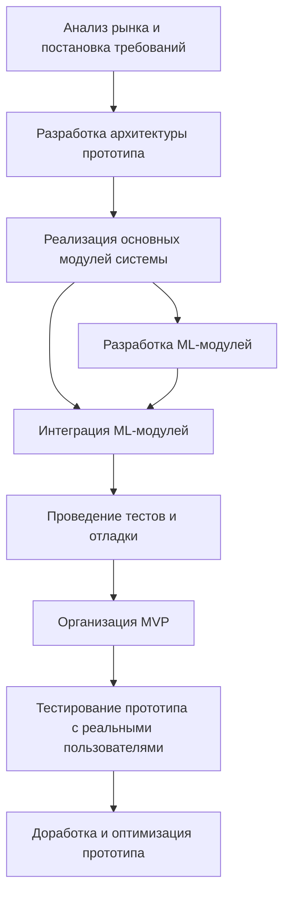

# Task 1 — Оценка ресурсов проекта

## Тема проекта

Разработка второго прототипа системы умного дома для людей с ОВЗ с применением машинного обучения

## Основные задачи проекта

1. Анализ рынка и постановка требований.

2. Разработка архитектуры прототипа (аппаратной + IoT-инфраструктура).

3. Реализация основных модулей системы: подсистема микроклимата, управление нагрузками (умные розетки, освещение), СКУД и события безопасности (газ, дым, протечки).

4. Разработка ML-модулей (RNN, Speech-to-Intent System).

5. Интеграция ML-модулей с разработанным вторым прототипом.

6. Проведение тестов и отладки.

7. Организация MVP.

8. Тестирование прототипа с реальными пользователями.

9. Доработка и оптимизация прототипа.

## Исходные условия

Первый прототип системы умного дома уже собран и полностью функционирует.
Данный прототип состоит из основных модулей (модуль управления микроклиматом, модуль СКУД, модуль управления розетками и освещением, модуль позиционирования пользователя в пространстве, модуль контроля расхода воды и электричества, модуль контроля безопасности) и оснащён всеми необходимыми датчиками и устройствами управления.

## Требуемые ресурсы

### Люди

- **Руководитель проекта (PM)** — планирование, коммуникации, контроль сроков/рисков; приёмка результата. Плановая занятость: ~20 ч.

- **Разработчик Full‑stack/Embedded** — MQTT/REST, БД, интеграция устройств, UI. Плановая занятость: ~140 ч.

- **QA инженер** — стратегия тестирования, unit/integration/e2e, отчёты дефектов. Плановая занятость: ~40 ч.

- **ML-разработчик** — архитектура ML модулей, структура данных для dataset, тестирование ML модулей. Плановая занятость: ~30 ч.

- **DevOps инженер** — CI/CD, контейнеризация, оптимизация системы, наблюдаемость. Плановая занятость: ~26 ч.

- **QA-инженер** — проведение тестов работы ПО, проведение тестов работы системы. Плановая занятость: ~ 45 ч.

### Оборудование

- Собранный первый прототип системы умного дома для людей с ОВЗ.
- VDS: **CPU**: 8–16 ядер (Intel Xeon / AMD EPYC или Ryzen 9), **RAM**: 64 ГБ, **GPU**: NVIDIA GPU с 8–16 ГБ VRAM (например, RTX 3060/3080,A10,T4), **DISK**: 200–500 ГБ NVMe SSD.

### Программное обеспечение

- ЯП: Python, + библиотеки: openai-whisper, rasa, transformers torch, tensorflow. SpeechRecognition, vosk.
- PostgreSQL/SQLite; Playwright/Jest.
- GitLab/GitHub с CI/CD; Docker/Podman.

## Финансовые ресурсы (ориентировочно, ₽)

- Люди: ≈ 1 800 000 ₽/год
- Оборудование/сервисы: ≈ 100 000 ₽/год
- Поддержка прототипа: ≈ 150 000 ₽/год
- Резерв на риски (10%): ≈ 205 000 ₽
- **Итого:** **≈ 2 255 000 ₽**

##### Время

Общая продолжительность проекта — **12 месяцев**. 

## Сроки и этапы проекта

| №   | Этап                                              | Начало     | Конец      | Срок   |
| --- | ------------------------------------------------- |:----------:|:----------:|:------:|
| 1   | Анализ рынка и постановка требований              | 01.10.2025 | 31.10.2025 | 1 мес. |
| 2   | Разработка архитектуры прототипа                  | 01.11.2025 | 30.11.2025 | 1 мес. |
| 3   | Реализация основных модулей системы               | 01.12.2025 | 31.01.2026 | 2 мес. |
| 4   | Разработка ML-модулей                             | 01.02.2026 | 31.03.2026 | 2 мес. |
| 5   | Интеграция ML-модулей                             | 01.04.2026 | 30.04.2026 | 1 мес. |
| 6   | Проведение тестов и отладки                       | 01.05.2026 | 31.05.2026 | 1 мес. |
| 7   | Организация MVP                                   | 01.06.2026 | 30.06.2026 | 1 мес. |
| 8   | Тестирование прототипа с реальными пользователями | 01.07.2026 | 31.07.2026 | 1 мес. |
| 9   | Доработка и оптимизация прототипа                 | 01.08.2026 | 31.08.2026 | 1 мес. |

## Приоритеты и зависимости (flowchart)

